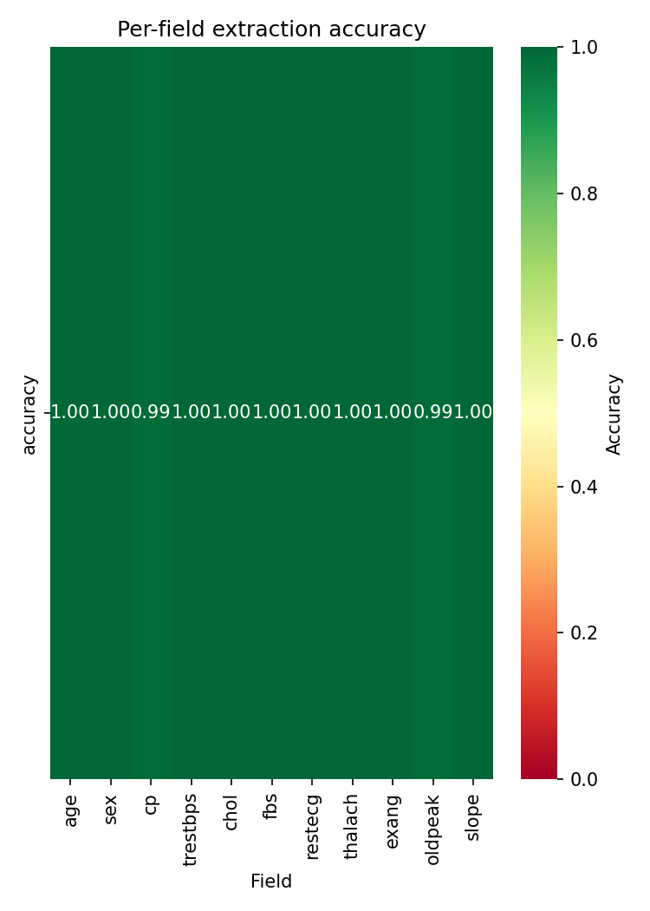
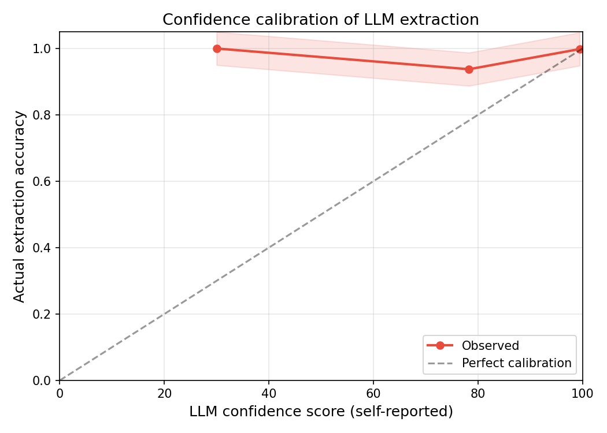
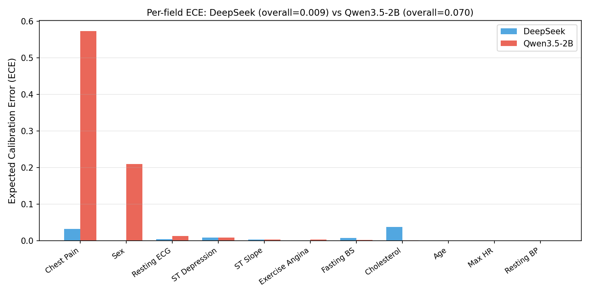
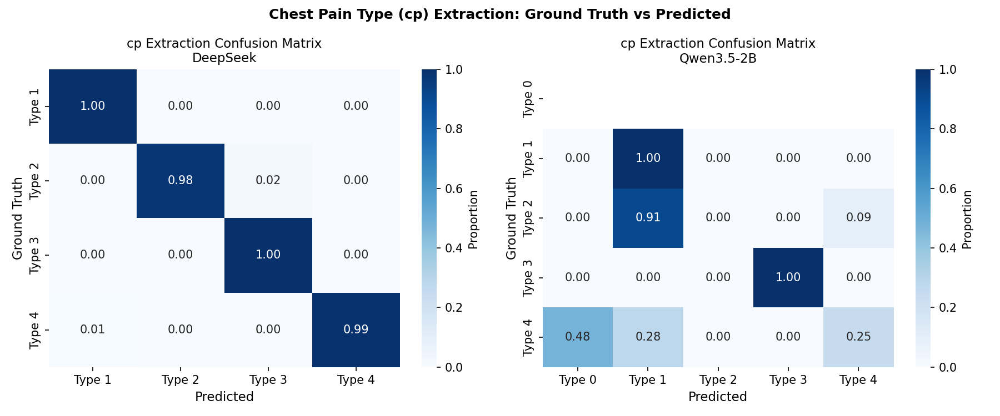
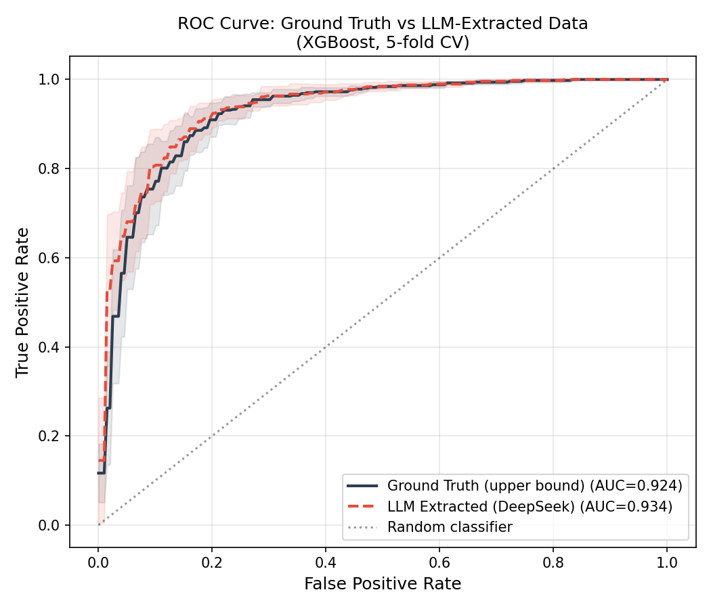
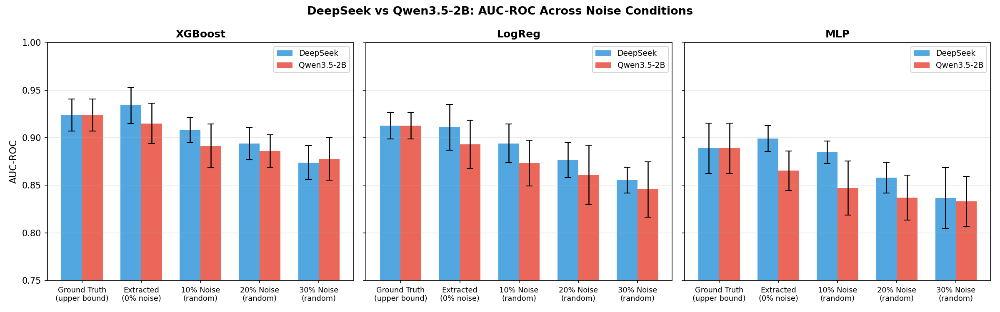
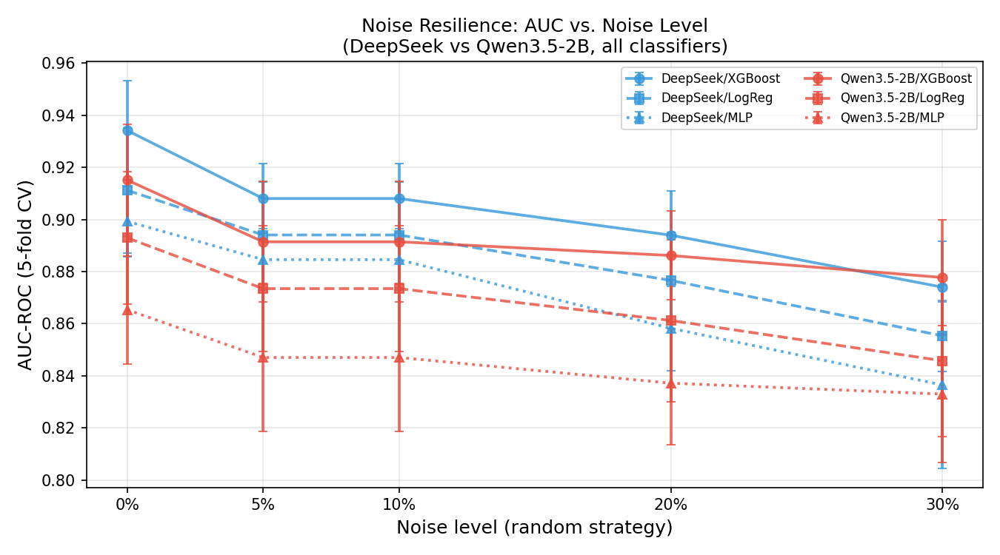

# T2T: Evaluating LLM Extraction Error Propagation in Clinical Prediction Pipelines

> **Table-to-Text-to-Table** — How faithfully can LLMs reconstruct structured clinical data from free-text notes, and what happens to downstream prediction when they fail?

This repository contains the code, data, and figures for the paper:

**"Error Propagation in LLM-Mediated Clinical Data Pipelines: A Table-to-Text-to-Table Fault-Tolerance Study"**
*Zhanbing Li, Kunming Medical University*

---

## Overview

This project studies the **T2T (Table-to-Text-to-Table) pipeline**: structured clinical data is first converted into free-text notes by an LLM, then re-extracted back into structured form by a second LLM. We measure how extraction errors propagate into downstream ML-based cardiac disease prediction.

**Research questions:**
1. How accurately do LLMs of different sizes extract structured clinical fields from free-text notes?
2. Are LLM confidence scores well-calibrated?
3. How much do extraction errors degrade downstream prediction (AUC-ROC)?
4. Does extraction error concentrate in clinically important features?

---

## Pipeline

```
UCI Heart Disease (918 samples)
         |
         v
  [DeepSeek API] --> Clinical Notes (free text)
         |
         |---> [DeepSeek] --> Extracted structured fields
         '---> [Qwen3.5-2B (local)] --> Extracted structured fields
                    |
                    v
         Noise injection (5 levels x 2 strategies)
                    |
                    v
         Downstream ML: XGBoost / LogReg / MLP
                    |
                    v
         AUC-ROC evaluation (5-fold CV)
```

---

## Key Results

### 1. Extraction Accuracy

DeepSeek achieves near-perfect extraction across all 11 clinical fields. Qwen3.5-2B (2B parameters) struggles significantly with multi-class categorical fields, particularly chest pain type (`cp`).

| Field | DeepSeek Accuracy | Qwen3.5-2B Accuracy |
|-------|:-----------------:|:-------------------:|
| age | 1.000 | 1.000 |
| sex | 1.000 | 0.790 |
| **cp** | **0.990** | **0.426** |
| trestbps | 1.000 | 1.000 |
| chol | 0.999 | 0.999 |
| fbs | 1.000 | 0.998 |
| restecg | 1.000 | 0.987 |
| thalach | 1.000 | 1.000 |
| exang | 1.000 | 0.997 |
| oldpeak | 0.991 | 0.991 |
| slope | 0.999 | 0.997 |



---

### 2. Confidence Calibration (ECE)

LLM self-reported confidence scores reveal a stark contrast in **metacognitive ability**:

- **DeepSeek ECE = 0.009** — near-perfect calibration (high confidence = high accuracy)
- **Qwen3.5-2B ECE = 0.070** — severely overconfident; reports 100% confidence even when accuracy is only 42.6%





---

### 3. Chest Pain Type — Systematic Errors in Qwen3.5-2B

Qwen3.5-2B does not simply make random errors. For `cp`, it generates **183 predictions of value `0`** — a value that does not exist in the dataset's valid range (1-4). This reveals systematic hallucination rather than random noise.



---

### 4. Downstream Prediction Performance

Despite Qwen3.5-2B's 57% error rate on `cp`, XGBoost AUC drops only modestly:

| Condition | DeepSeek XGBoost AUC | Qwen3.5-2B XGBoost AUC |
|-----------|:--------------------:|:----------------------:|
| Ground Truth (upper bound) | 0.924 | 0.924 |
| Clean extracted (0% noise) | **0.934** | 0.915 |
| 10% noise (random) | 0.908 | 0.891 |
| 20% noise (random) | 0.894 | 0.886 |
| 30% noise (random) | 0.874 | 0.878 |

Notably, **DeepSeek extracted data slightly outperforms ground truth** (0.934 vs 0.924), suggesting LLM-mediated note generation may smooth outliers in the original structured data.





---

### 5. Feature Importance vs. Extraction Error

A key finding: **extraction error rate is uncorrelated with XGBoost feature importance** (Pearson r = 0.03 for both models). This explains why high extraction error on `cp` causes only minor AUC degradation — the impact depends on the predictive contribution of the corrupted field, not the error rate alone.

---

### 6. Noise Resilience

All three classifiers maintain reasonable AUC even under 30% random field corruption. XGBoost is consistently the most robust.

| Model | DeepSeek AUC drop (0%->30%) | Qwen2b AUC drop (0%->30%) |
|-------|:--------------------------:|:------------------------:|
| XGBoost | -0.060 | -0.037 |
| LogReg | -0.056 | -0.047 |
| MLP | -0.063 | -0.032 |



---

## Repository Structure

```
research_pt/
├── manuscript/
│   └── manuscript.md              # Full manuscript (medRxiv format)
├── config/
│   └── api_config.yaml            # Model configs, noise parameters
├── prompts/
│   ├── generation_prompt.txt      # Clinical note generation prompt
│   └── extraction_prompt.txt      # Structured extraction prompt (JSON schema)
├── src/
│   ├── prepare_data.py            # UCI data preprocessing
│   ├── generate_notes.py          # LLM clinical note generation
│   ├── extract_structured.py      # Multi-model structured extraction
│   ├── analyze_extraction.py      # Per-field accuracy & calibration analysis
│   ├── noise_injection.py         # Gradient noise injection
│   ├── train_evaluate.py          # ML training & evaluation
│   └── advanced_analysis.py       # Statistical tests, ECE, comparison figures
├── results/                       # Experiment result CSVs
│   ├── deepseek/                  # DeepSeek extraction results
│   ├── qwen2b/                    # Qwen3.5-2B extraction results
│   └── comparison/                # Cross-model comparison data
├── figures/                       # All generated figures (PNG + PDF)
│   ├── deepseek/
│   ├── qwen2b/
│   └── comparison/
├── docs/figures/                  # Key figures for this README
├── data/
│   └── processed/                 # Preprocessed dataset (included)
└── pyproject.toml                 # Python dependencies
```

> **Note:** Raw data, generated clinical notes, extracted JSON, and noisy datasets are excluded from this repository as they are large and fully regeneratable from the pipeline. The preprocessed dataset (`data/processed/heart_processed.csv`) is included.

---

## Reproducing the Experiments

**Requirements:** Python 3.11+, [uv](https://github.com/astral-sh/uv)

```bash
# Install dependencies
uv sync

# Step 1: Preprocess UCI Heart Disease data
uv run python src/prepare_data.py

# Step 2: Generate clinical notes (requires DEEPSEEK_API_KEY)
export DEEPSEEK_API_KEY=sk-...
uv run python src/generate_notes.py

# Step 3: Extract structured fields
uv run python src/extract_structured.py --model deepseek
uv run python src/extract_structured.py --model qwen2b   # requires Ollama with qwen3.5:2b

# Step 4: Analyze extraction quality
uv run python src/analyze_extraction.py --model deepseek
uv run python src/analyze_extraction.py --model qwen2b

# Step 5: Inject noise and evaluate downstream models
uv run python src/noise_injection.py --model deepseek
uv run python src/train_evaluate.py --model deepseek

# Step 6: Advanced analysis and comparison figures
uv run python src/advanced_analysis.py
```

---

## Models Used

| Role | Model | Provider |
|------|-------|----------|
| Note generation | `deepseek-chat` | DeepSeek API |
| Extraction (commercial) | `deepseek-chat` | DeepSeek API |
| Extraction (local) | `qwen3.5:2b` | Ollama (local) |

---

## Dataset

[UCI Heart Disease Dataset](https://archive.ics.uci.edu/dataset/45/heart+disease) — 918 samples, 11 clinical features, binary target (heart disease present/absent).

Features: age, sex, chest pain type (cp), resting blood pressure (trestbps), cholesterol (chol), fasting blood sugar (fbs), resting ECG (restecg), max heart rate (thalach), exercise-induced angina (exang), ST depression (oldpeak), ST slope (slope).

---

## Limitations

- Clinical notes are LLM-generated (synthetic), not from real EHR systems
- Single dataset; generalizability to other clinical domains is not yet validated
- Statistical comparisons are underpowered with 5-fold CV (n=5 paired observations)
- Local model tested at 2B parameters only; mid-scale (7-9B) results pending

---

## Citation

If you use this code or find our results useful, please cite:

```
Li, Z. (2026). Error Propagation in LLM-Mediated Clinical Data Pipelines:
A Table-to-Text-to-Table Fault-Tolerance Study. medRxiv preprint.
```

---

## License

This project is released under the [MIT License](LICENSE).
